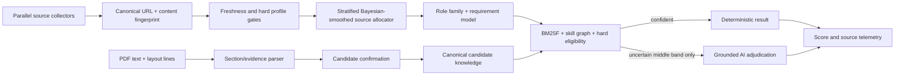

# Research-backed discovery, parsing, and matching

Status: implemented local baseline. Neural training and production calibration remain gated on labelled outcomes.

## Architecture

## Decisions implemented

1. Collectors run concurrently. Selection is stratified by actual source, including `jobspy:linkedin` and `jobspy:indeed`, so one collector cannot consume the entire scoring budget.
2. Every source with a fresh eligible candidate receives an exploration slot when the run limit permits. Remaining capacity follows Bayesian-smoothed compatible yield, unique yield, recency, and bounded uncertainty. Sparse lucky sources cannot immediately monopolise a run.
3. Canonical URLs are indexed. Repeated unchanged jobs update `last_seen_at` and `discovery_count` but are not rescored. A content fingerprint detects material same-URL changes, including equal-length edits, and queues only those changes.
4. Matching separates career family, capability, preference, hard experience eligibility, location, and compensation. Required skills carry more weight than preferred/context mentions; negated skills are ignored; `A or B` is one alternative requirement.
5. Related technology earns partial relevance credit but never becomes a claim in a resume variant.
6. BM25F-style lexical evidence and the skill graph run before AI. AI is invoked only in an uncertain middle band and its score is reconciled with deterministic evidence.
7. Resume parsing uses layout-preserved PDF text, section boundaries, date ranges, evidence, and confidence. Verified master data may recover a missing section only when identity matches; the fallback is explicitly recorded instead of hiding parser failure. PDFs without a usable text layer are marked `OCR_REQUIRED`.
8. The dashboard exposes source allocation/yield, recommended daily fetch/process counts, heuristic AI-avoidance, AI calls, and estimated token cost.

## Why this shape

- Contextual-bandit research supports retaining exploration while learning from heterogeneous source contexts. This implementation uses a deterministic, Bayesian-smoothed allocator because current rewards are sparse and production labels are not yet sufficient for a learned policy: [Stochastic Linear Contextual Bandits with Diverse Contexts](https://proceedings.mlr.press/v108/wu20c.html), [An Unbiased Offline Evaluation of Contextual Bandit Algorithms](https://proceedings.mlr.press/v26/li12a.html).
- Hybrid retrieval is safer and cheaper than model-only scoring. The local stage combines sparse lexical retrieval with structured semantic evidence; a future offline retriever can use late interaction or learned sparse expansion after a labelled corpus exists: [SPLATE](https://arxiv.org/abs/2404.13950), [SPLADE](https://arxiv.org/abs/2107.05720).
- Skill extraction benefits from taxonomy/graph relationships, but similarity must not create unsupported claims: [Multilingual Skill Extraction for Job Vacancy–Job Seeker Matching in Knowledge Graphs](https://aclanthology.org/2025.genaik-1.15/), [JobXMLC](https://aclanthology.org/2023.findings-eacl.163/).
- Resume parsing needs text, visual layout, and hierarchy. The current local parser preserves layout lines and exposes an upgrade boundary for a trained document model; it does not pretend a regex parser is equivalent to one: [Towards Efficient Resume Understanding](https://arxiv.org/abs/2404.13067), [DocHieNet](https://aclanthology.org/2024.emnlp-main.65/), [LayoutLMv3](https://arxiv.org/abs/2204.08387).
- LLM scores remain advisory. A 2025 observational study found only minor correlation between zero-shot LLM and human resume ratings, so deterministic hard constraints and review remain authoritative: [Human and LLM-Based Resume Matching](https://aclanthology.org/2025.findings-naacl.270/).
- A future trained resume-job retriever should use hard negatives and offline evaluation rather than live self-modification: [ConFit v2](https://aclanthology.org/2025.findings-acl.661/).

## Promotion gate for learned models

A learned source policy, parser, or matcher may replace the local baseline only after:

1. candidate-confirmed labels are separated from clicks and impressions;
2. train/validation/test splits are time-based and company-grouped to prevent leakage;
3. hard experience, privacy, and unsupported-claim tests remain invariant;
4. offline ranking improves NDCG/Recall at the same or lower false-positive rate;
5. shadow results are logged before any user-visible ranking changes;
6. per-career-family and source calibration is measured, not inferred from global averages.

No learning job edits live extension logic or silently promotes candidate facts.
